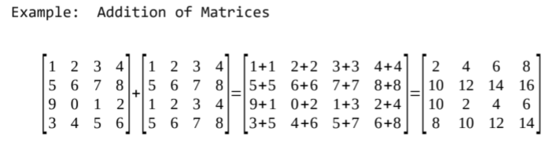

# 2-Dimensional Arrays

Complete the following exercises using the starter code provided.  You should demonstrate how your functions work using this code.

## Exercises

## 03-0: Random Matrix

Create a function called **RandomMatrix(int n)** that creates a 2-dimensional array (matrix), with **n** rows and **n** columns, made up of 0's and 1's chosen randomly.  The function should return the array that gets created.

## 03-1: Find

Create a function called **Find(int[,] m, int x)** that searches for a value **x** in a matrix (2-dimensional array) **m**.  It should return the position {row, col} if it finds it, otherwise it returns {-1,-1}.

## 03-2: Addition

Create a function called **Add(int[,] m,int[,] n)** that adds two matrices *(integer 2d-arrays)* , of the same size, and returns the new 2-dimensional array. Here is how addition works with matrices.

## 03-3: Scalar

Create a function called **Scalar(int[,] m, int k)** that multiplies every value of a matrix **m** by the value **k** and returns the new 2-dimensional array.

## 03-4: Sum of Neighbours

Create function called **SumNeighbours(int[,] m, int row, int col)** that finds the sum of the neighbours of any value in the position (row,col) of the matrix (2-dimensional array).  A neighbour is any value left, right, above, below, or diagonal to the position (row,col).  The function should return the number of neighbours.
